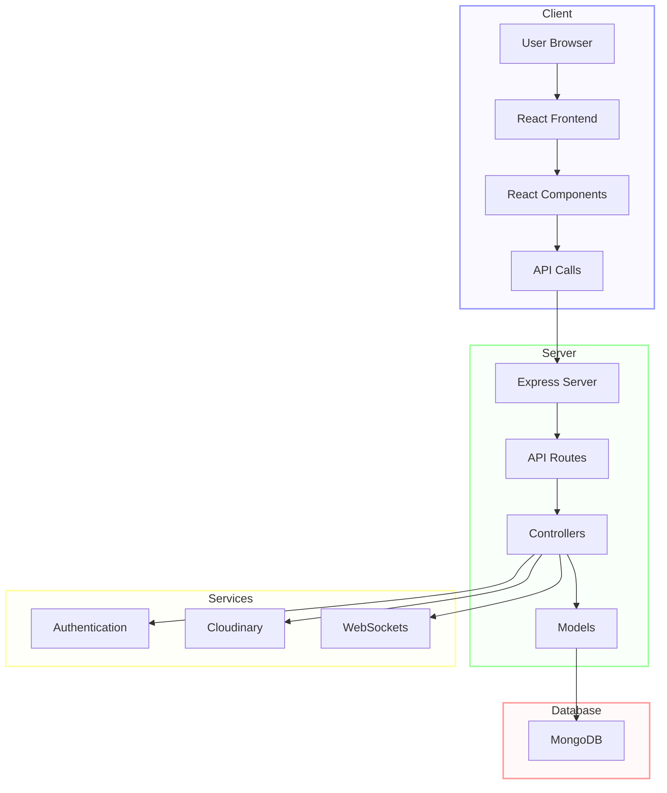
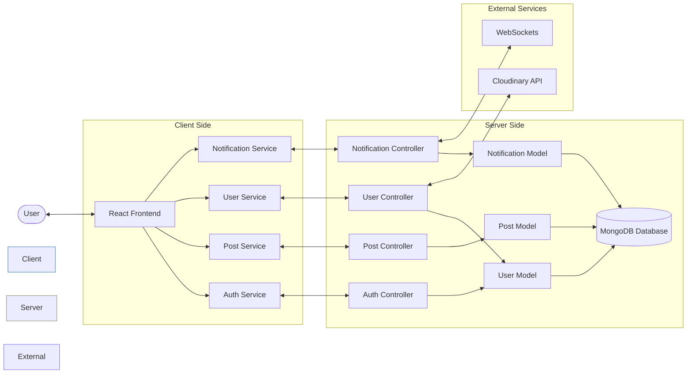

<div align="center">
  


### *Because sometimes, spilling the tea isn't enough - Let's leak the Raita!*
  
[](https://www.mongodb.com/mern-stack)
[](LICENSE)
[](CONTRIBUTING.md)

</div>

---

## 💫 What is RaitaLeaks?

RaitaLeaks is a modern social media platform built on the powerful MERN stack. It demonstrates how contemporary social networking can combine robust functionality with an intuitive user experience.

> 💡 **Vision**: Creating a space where sharing experiences becomes seamless, engaging, and meaningful.

Users can register, personalize their digital presence, share content, connect with like-minded individuals, and engage with a community that values authentic expression.

---
## 📸 Snippets of our work 

### Homepage


### Profile Page


### Notifications


### Login Page


---

## ✨ Feature Highlights

<table>
  <tr>
    <td width="50%">
      <h3>🔐 User Experience</h3>
      <ul>
        <li>Intuitive authentication system</li>
        <li>Personalized profile customization</li>
        <li>Smart following system</li>
      </ul>
    </td>
    <td width="50%">
      <h3>📱 Content Creation</h3>
      <ul>
        <li>Dynamic post creation and sharing</li>
        <li>Media uploads and integration</li>
        <li>Interactive reactions and comments</li>
      </ul>
    </td>
  </tr>
  <tr>
    <td width="50%">
      <h3>🔔 Connectivity</h3>
      <ul>
        <li>Real-time notification system</li>
        <li>WebSocket integration for instant updates</li>
      </ul>
    </td>
    <td width="50%">
      <h3>📊 Design & UX</h3>
      <ul>
        <li>Responsive design across all devices</li>
        <li>Intuitive, user-centered interface</li>
      </ul>
    </td>
  </tr>
</table>

---

## 🛠️ Technology Stack

<div align="center">

### 🔧 MERN: Powerful & Flexible 🔧

</div>

| Layer | Technology | Functionality |
|-------|------------|---------------|
| 🎨 **Frontend** | React.js | Interactive UI components with state management |
| ⚙️ **Backend** | Node.js + Express.js | Fast, scalable server-side operations |
| 🗄️ **Database** | MongoDB | Flexible, document-based data storage |
| 🖼️ **Storage** | Cloudinary | Cloud-based media management |
| 🔑 **Security** | JWT & OAuth | Robust authentication protocols |
| ⚡ **Realtime** | WebSockets | Instant bi-directional communication |

---

## 🚀 Getting Started

### 📋 Prerequisites

- Node.js (latest stable version)
- MongoDB account
- Cloudinary account (optional, for image storage)

### 📥 Installation

#### 1️⃣ Clone the Repository

```bash
git clone [repository URL]
cd raita-leaks
```

#### 2️⃣ Install Dependencies

```bash
# Install backend dependencies
npm install

# Install frontend dependencies
cd frontend
npm install
cd ..
```

#### 3️⃣ Configure Environment Variables

Create a `.env` file in the root directory:

```
MONGODB_URI=your_mongodb_connection_string
JWT_SECRET=your_secret_key
CLOUDINARY_CLOUD_NAME=your_cloudinary_name
CLOUDINARY_API_KEY=your_cloudinary_api_key
CLOUDINARY_API_SECRET=your_cloudinary_api_secret
```

### 🖥️ Running the Application

#### Production Mode

```bash
# Build the frontend
cd frontend
npm run build
cd ..

# Start the application
npm run start
```

#### Development Mode

```bash
# Start the backend server
npm run dev

# In a new terminal, start the frontend
cd frontend
npm run dev
```

Access the application at `http://localhost:5173` (or the port specified by Vite)

---

## 📁 Project Architecture

### System Architecture Overview



### Directory Structure

```
📦 RaitaLeaks
 ┣ 📂 backend
 ┃ ┣ 📂 controllers
 ┃ ┃ ┣ 📄 auth.controller.js
 ┃ ┃ ┣ 📄 notifications.controller.js
 ┃ ┃ ┣ 📄 post.controller.js
 ┃ ┃ ┗ 📄 user.controller.js
 ┃ ┣ 📂 models
 ┃ ┃ ┣ 📄 notification.model.js
 ┃ ┃ ┣ 📄 post.model.js
 ┃ ┃ ┗ 📄 user.model.js
 ┃ ┣ 📂 routes
 ┃ ┃ ┣ 📄 auth.route.js
 ┃ ┃ ┣ 📄 notification.route.js
 ┃ ┃ ┣ 📄 post.route.js
 ┃ ┃ ┗ 📄 user.route.js
 ┃ ┗ 📄 server.js
 ┣ 📂 frontend
 ┃ ┣ 📂 public
 ┃ ┃ ┗ 📂 favicon_io
 ┃ ┗ 📂 src
 ┃   ┣ 📂 components
 ┃   ┣ 📂 hooks
 ┃   ┣ 📂 pages
 ┃   ┣ 📂 styles
 ┃   ┗ 📂 utils
```

### Data Flow Diagram



---

## 🤝 Contributing

We welcome contributions to RaitaLeaks! Here's how to get involved:

1. **Fork** the repository
2. **Create** your feature branch (`git checkout -b feature/amazing-feature`)
3. **Commit** your changes (`git commit -m 'Add some amazing feature'`)
4. **Push** to the branch (`git push origin feature/amazing-feature`)
5. **Submit** a Pull Request

---

## 📄 License

This project is licensed under the MIT License - see the LICENSE file for details.

---

## 👏 Acknowledgments

- **404Coders team** for creating and maintaining the project

<div align="center">

---

### *© 2025 RaitaLeaks. Created with ❤️ by 404Coders.*

<p align="center">
  <a href="https://github.com/yourusername/RaitaLeaks">
    
  </a>
  <a href="https://github.com/yourusername/RaitaLeaks/network/members">
    
  </a>
  <a href="https://github.com/yourusername/RaitaLeaks/issues">
    
  </a>
</p>

</div>
